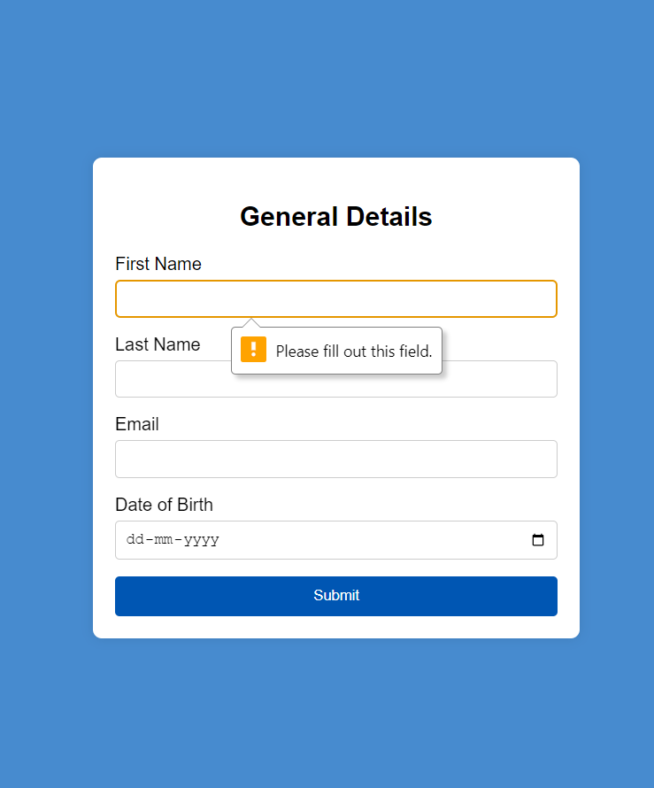

# General Details Form

A simple web form that collects general details including first name, last name, email, and date of birth.

## Preview

## Table of Contents

- [Introduction](#introduction)
- [Usage](#usage)
- [Technologies Used](#technologies-used)
- [Contributing](#contributing)
- [License](#license)

## Introduction

The **General Details Form** is a basic web form built using HTML and styled with CSS. It allows users to input their first name, last name, email, and date of birth. The form ensures that all fields are filled before submission using simple JavaScript validation.

## Usage

1. Open the `index.html` file in a web browser.

2. Fill out the form with your general details:

   - First Name
   - Last Name
   - Email
   - Date of Birth

3. Click the "Submit" button to submit the form.

4. If any of the fields are not filled out, you will receive an alert prompting you to fill in all fields.

## Technologies Used

- HTML: Structure of the web page and form elements.
- CSS: Styling and layout of the form and page.
- JavaScript: Validation of form fields before submission.

## Contributing

Contributions to this project are welcome! If you find any bugs or want to enhance the form, please feel free to open an issue or submit a pull request. Here's how you can contribute:

1. Fork the repository.
2. Create a new branch for your feature: `git checkout -b feature-new-feature`.
3. Commit your changes: `git commit -m 'Add new feature'`.
4. Push to the branch: `git push origin feature-new-feature`.
5. Open a pull request.

## License

This project is licensed under the MIT License. See the [LICENSE](LICENSE) file for details.
